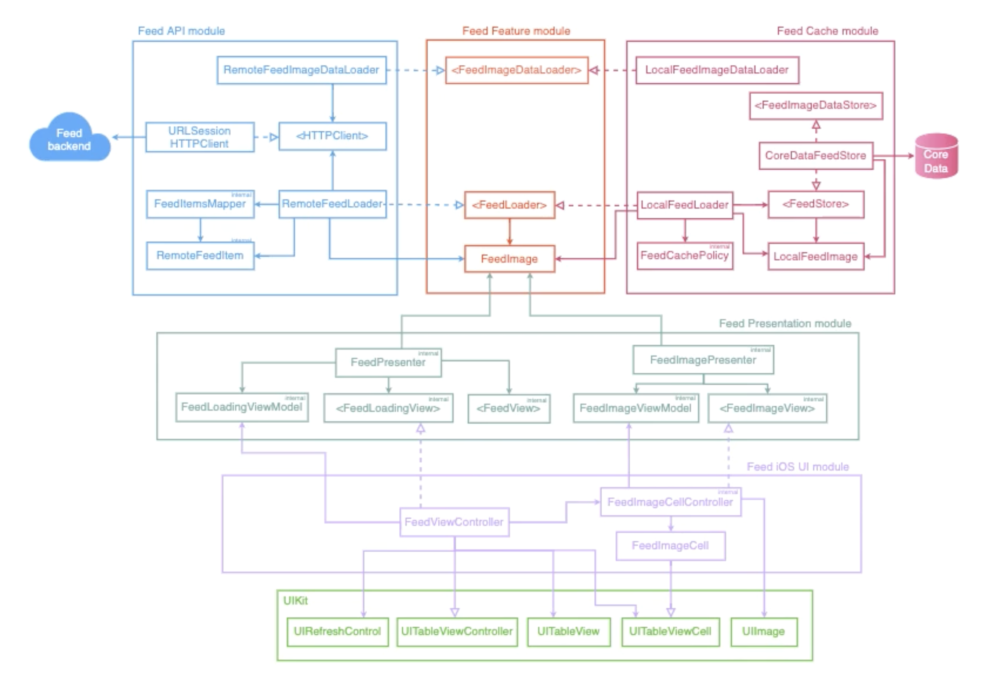

# EssentialApp

This is a regular news feed application built on a multimodal basis. 

The application is divided into the following modules, some of which are platform-independent, i.e., can be used for macOS, tvOS, watchOS:
- Essential Feed - platform-agnostic framework, contain core logic
- Essential Feed API - platform-agnostic framework, contain logic collaborating with the network 
- Essential Feed Cache - platform-agnostic framework, contain cache logic using CoreData storage.
- Essential Feed Presentation - platform agnostic framework, contain presentation logic
- Essential Feed iOS - contain UIKit representation logic.
- Essential App - application module. Contain composition logic.

This approach demonstrates a flexible architecture that makes the code extensible. 
Multimodularity is illustrated in the picture below. 

#### Test coverage: 
All application modules are tested by using **unit tests**; 
Essential Feed Cache and Essential Feed API modules are additionally covered by the **integration tests**. 
Essential Feed iOS additionally covered by **snapshot tests**; 

#### CI / CD 
The main development in the project is in the ‘develop’ branch. Each push / pull_request in the main branch trigger  
CI_macOS - run tests for platform-agnostic modules on “platform=macOS” 
CI_iOS - run tests for all modules which should be available on iOS, including integration tests on “name=iPhone 12,OS=14.2” 
It also triggers the job to deploy the build result in **TestFlight**.

#### Features:
1. Localization on 3 languages
2. Dark / light mode

## App Architecture

## App Requirements

[Feed Image Use Cases](./docs/use_cases.md)
